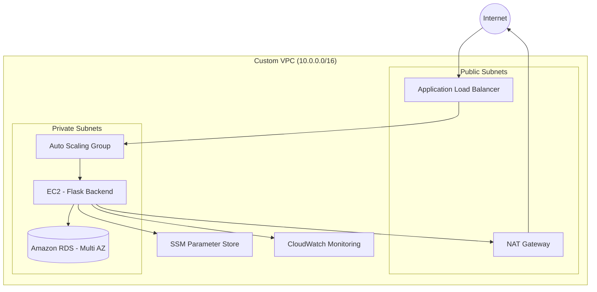

# 🚀 AWS 3-Tier Highly Available Architecture

## 📌 Project Overview

This project demonstrates the design and deployment of a **highly available, scalable, and secure 3-tier web application architecture on AWS**.

A Flask backend application is deployed on EC2 instances inside private subnets, connected to an Amazon RDS database. Traffic is routed through an Application Load Balancer and scales automatically based on CPU utilization.

This project reflects real-world cloud architecture practices used in production environments.

---

# 🏗️ Architecture Diagram

---

# 🧱 AWS Services Used

- Amazon VPC (Custom networking)
- Public & Private Subnets (Multi-AZ)
- Internet Gateway
- NAT Gateway
- Application Load Balancer (ALB)
- EC2 (Amazon Linux 2023)
- Auto Scaling Group
- Amazon RDS (Multi-AZ, Private)
- IAM Roles
- AWS Systems Manager Parameter Store
- CloudWatch (Monitoring & Alarms)

---

# 🔐 Security Implementation

- No EC2 instance has a public IP
- RDS deployed in private subnet only
- Security Groups restrict traffic by source
- Database credentials stored securely in SSM Parameter Store
- IAM role used instead of hardcoded credentials
- Application accessible only via ALB

---

# ⚙️ Application Details

Backend: Flask (Python)  
Port: 5000  

### API Endpoints

| Method | Endpoint | Purpose |
|--------|----------|---------|
| GET    | /health  | Health check |
| POST   | /submit  | Insert data into DB |
| GET    | /fetch   | Retrieve stored records |

---

# 📈 High Availability & Scaling

- Auto Scaling Group deployed across multiple Availability Zones
- Target Tracking Scaling Policy (50% CPU utilization)
- CloudWatch alarm triggers when CPU > 70%
- Load Balancer performs health checks using `/health`

---

# 🚀 Deployment Highlights

- Infrastructure manually designed using AWS Console
- Launch Template with automated user-data bootstrapping
- Virtual environment setup for backend
- Secure secret retrieval using SSM
- Private subnet architecture with NAT for outbound internet

---

# 🧠 Key Learning Outcomes

- Deep understanding of VPC networking and routing
- NAT Gateway and private subnet configuration
- IAM role-based secure secret management
- Auto Scaling and Load Balancer integration
- Production-style monitoring with CloudWatch
- Debugging real cloud infrastructure issues

---

# 🏆 Resume Summary

Designed and deployed a production-ready 3-tier AWS architecture using VPC, Auto Scaling Group, Application Load Balancer, and RDS (Multi-AZ). Implemented secure secret management with SSM Parameter Store and configured CPU-based Auto Scaling with CloudWatch monitoring.

---

# 🔮 Future Improvements

- HTTPS with AWS Certificate Manager
- CI/CD pipeline (GitHub Actions)
- Docker containerization
- Infrastructure as Code (Terraform)

---

# 👤 Author

Gyan Prakash  
Cloud & DevOps Enthusiast
