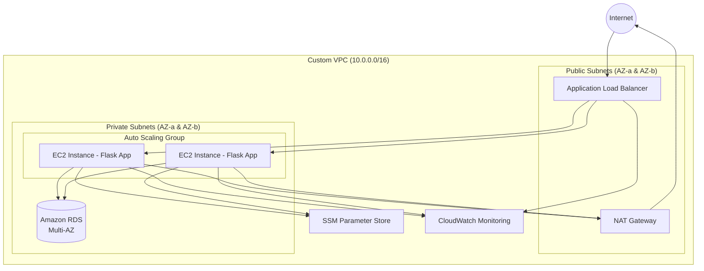

# AWS Resume Killer Project

## Overview
A highly available, secure, and scalable three-tier web application built on AWS.

## Architecture
- VPC with public and private subnets
- Application Load Balancer
- EC2 Auto Scaling Group
- RDS (Multi-AZ)
- CloudFront + S3
- CloudWatch monitoring

